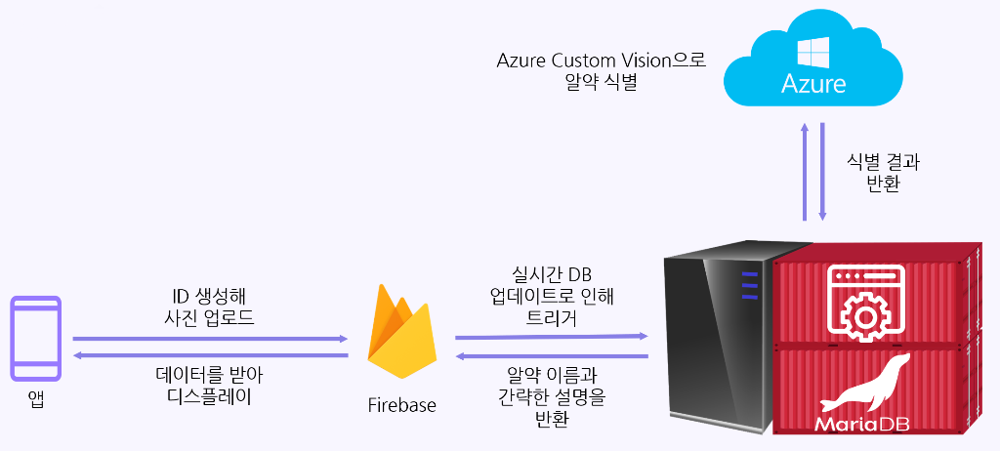
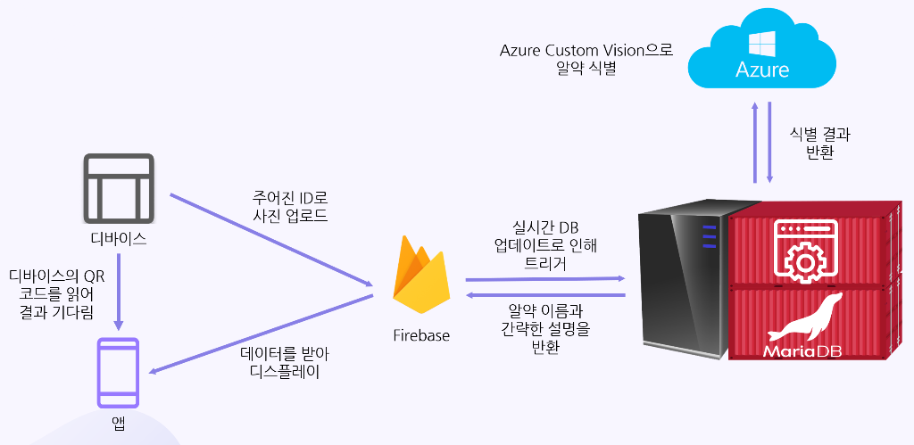
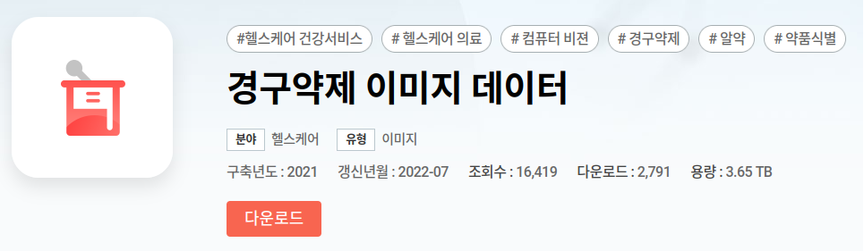
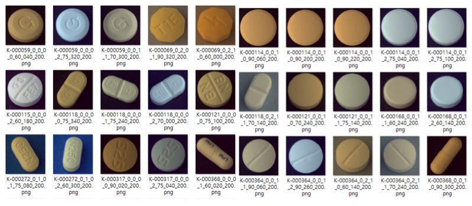
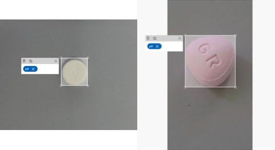
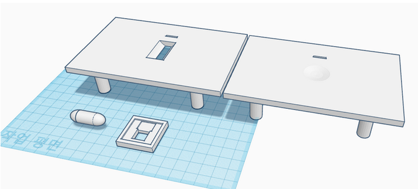
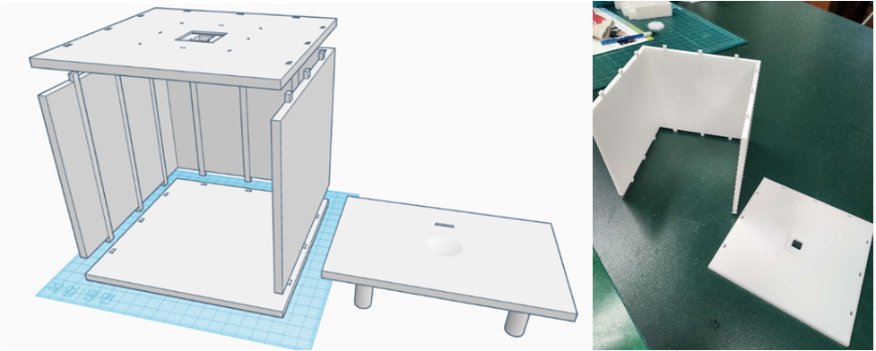
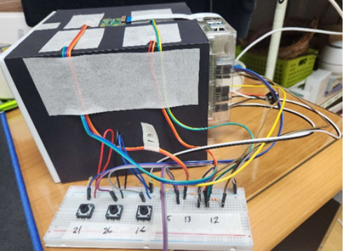

#### Architecture

##### Usecase #1: Using a phone camera

- User takes photos of a pill.
- Upload each photo into Firebase.
- For each photo, call Azure Custom Vision.
- Aggregate results and list them in the most likely order.
- For each item, fetch short descriptions from the MariaDB database.
- User will see a catalog of each pill's name and description in a card list format.

##### Usecase #2: Using a dedicated device

- User places the pill in the dedicated device to ensure consistent results.
- The device takes pictures and submits to Azure, same as before.
- User can scan a QR code on the device to access results.

#### Development Process

##### Training the pill recognition model

A 3.6TB dataset covering 5,000 different pills distributed in Korea was used. Due to the sheer size of the dataset, a random set of 100 different pills were picked.

During training, a problem appeared where the accuracy wouldn't improve no matter what.
The team and I theorized that the dataset had both front/back images of pills, and since the backsides looked the same, it lead to degraded performance.
A new model was trained to detect a pill's backside (checking if it was smooth) then used as a "middleware" model to preprocess incoming pictures.

The model returns bounding boxes to crop to, as the inclusion of background details was found to also harm recognition accuracy.

##### Device design

A Raspberry Pi with a 3D printed enclosure was designed to create a stable environment for taking images. The user can simply place the pill on the platform. The platform contains a mechanism to rotate the pill as needed.

#### Videos

<iframe
  width="560"
  height="315"
  src="https://www.youtube.com/embed/-Vi6D9p_a7c"
  title="YouTube video player"
  frameborder="0"
  allow="accelerometer; autoplay; clipboard-write; encrypted-media; gyroscope; picture-in-picture; web-share"
  referrerpolicy="strict-origin-when-cross-origin"
  allowfullscreen
></iframe>

<iframe
  width="560"
  height="315"
  src="https://www.youtube.com/embed/-nW0oRoQ2A0"
  title="YouTube video player"
  frameborder="0"
  allow="accelerometer; autoplay; clipboard-write; encrypted-media; gyroscope; picture-in-picture; web-share"
  referrerpolicy="strict-origin-when-cross-origin"
  allowfullscreen
></iframe>

<iframe
  width="560"
  height="315"
  src="https://www.youtube.com/embed/PHYtq332n_0"
  title="YouTube video player"
  frameborder="0"
  allow="accelerometer; autoplay; clipboard-write; encrypted-media; gyroscope; picture-in-picture; web-share"
  referrerpolicy="strict-origin-when-cross-origin"
  allowfullscreen
></iframe>

---

#### Repository

https://github.com/doyoungp00/FindPill
