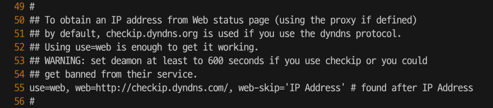
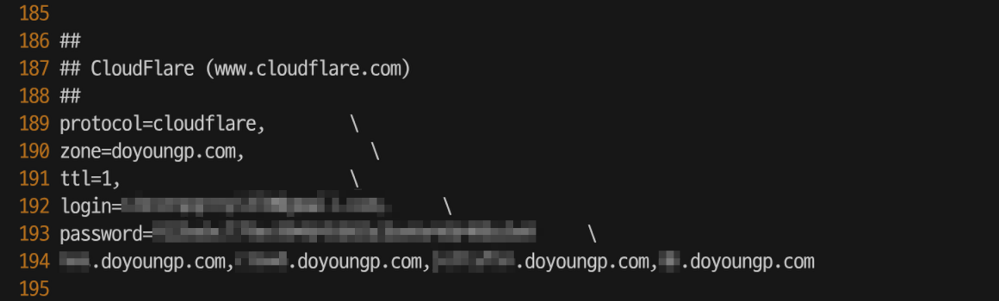
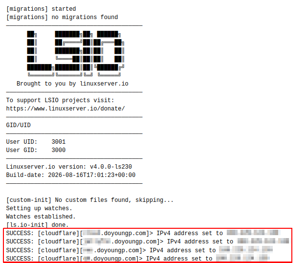

import ImageCaption from "@/components/ImageCaption.astro";
import { Image } from "astro:assets";

For home internet, not many users shell out extra cash to get a fixed IP address. Some ISPs don't even offer that option, forcing all home networks to have an external IP address that might change at any time.

This may cause challenges for homelab setups with outbound serives. One option is using a domain name alongside a Dynamic Domain Name System(DDNS) service.

1. A DDNS service running from the local network periodically asks for its public IP address.
2. If a change is detected, the service automatically sends requests to relevant DNS resolvers asking to update the DNS records to the newly changed IP address.
3. The DNS records now resolve correctly to the new IP address.

# ddclient installation and configuration

For docker-compose:

```yaml
services:
  ddclient:
    image: lscr.io/linuxserver/ddclient:latest
    container_name: ddclient
    environment:
      - PUID=1000 # Adjust if specific user permissions are needed to access config file
      - PGID=1000
      - TZ=Asia/Seoul
    volumes:
      - /path/to/persistent/config/file:/config
    restart: unless-stopped
```

On the first start, ddclient should generate a default config file at the specified path. Stop the container, and use a text editor to finish configuration.



For most cases the `use=web` option with the default website is good enough. To use it, simply uncomment the line.



Further down the file there are options with support for many domain providers. I personally use Cloudflare. Uncomment all of the options in the section, and fill out the proper credentials. For Cloudflare, the following values were used:

- zone: `doyoungp.com`
- login: the Cloudflare login email
- password: a [Global API Key](https://dash.cloudflare.com/profile/api-tokens)

And a comma-separated list of subdomains to keep updated goes on the last line.

With the container restarted, check the logs to see if DNS records are being updated successfully.


