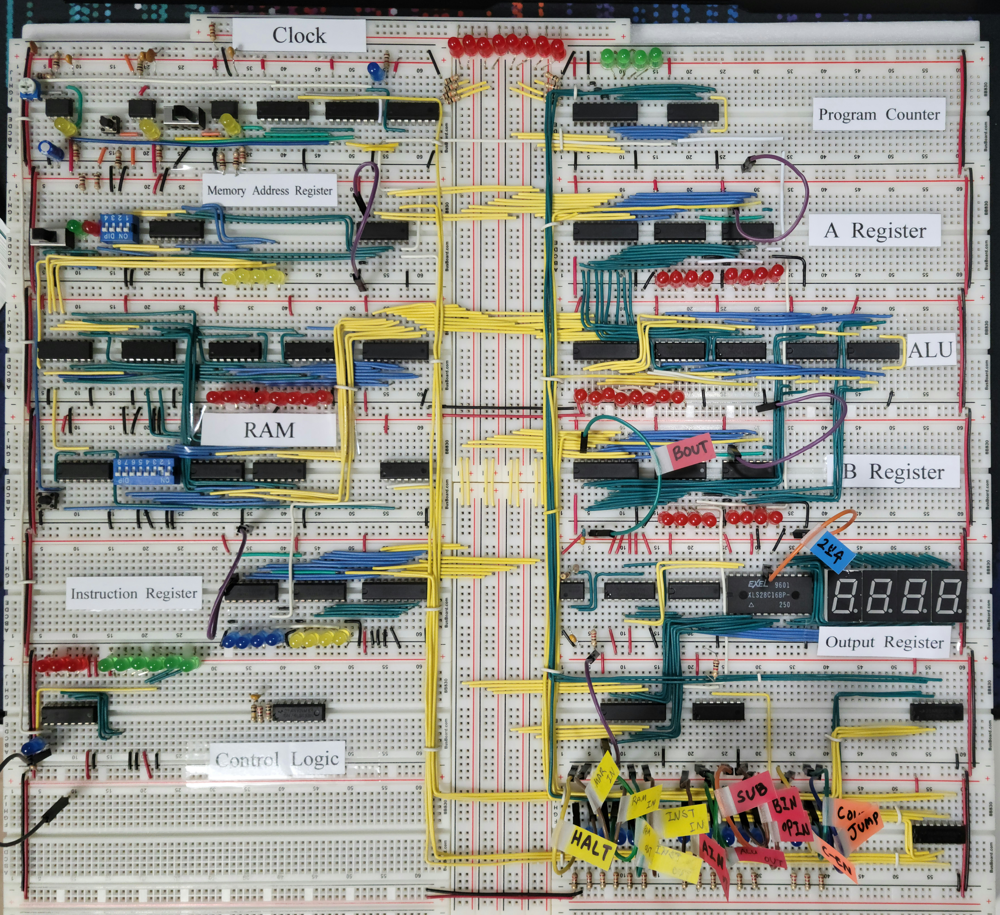

import ImageCaption from "@/components/ImageCaption.astro";
import { Image } from "astro:assets";

All modules are brought together and tied to the bus.

| Left of Bus          | Right of Bus                |
| -------------------- | --------------------------- |
| Clock                | Program Counter             |
| Address Register     | Register A                  |
| RAM                  | ALU                         |
| Instruction Register | Register B                  |
| Control Logic        | Output Register and Display |

<iframe
  width="100%"
  style="aspect-ratio: 16/9"
  src="https://www.youtube-nocookie.com/embed/Cvdp1IKIK0U?si=vmhhd6Xo2nqnW331"
  title="YouTube video player"
  frameborder="0"
  allow="accelerometer; autoplay; clipboard-write; encrypted-media; gyroscope; picture-in-picture; web-share"
  referrerpolicy="strict-origin-when-cross-origin"
  allowfullscreen
/>

A test run of the CPU was held. It's a simple count up where Register A is set to zero and Register B holds the value of 1. The ALU is set to add, and the resulting value cycles thorugh the available output values.
It's not a full fetch-decode-execute cycle of a program, but still a nice demonstration.

Every control line such as bus read, bus upload, and 2's complement is brought down to the bottom right corner to provide a convenient place for operation.

