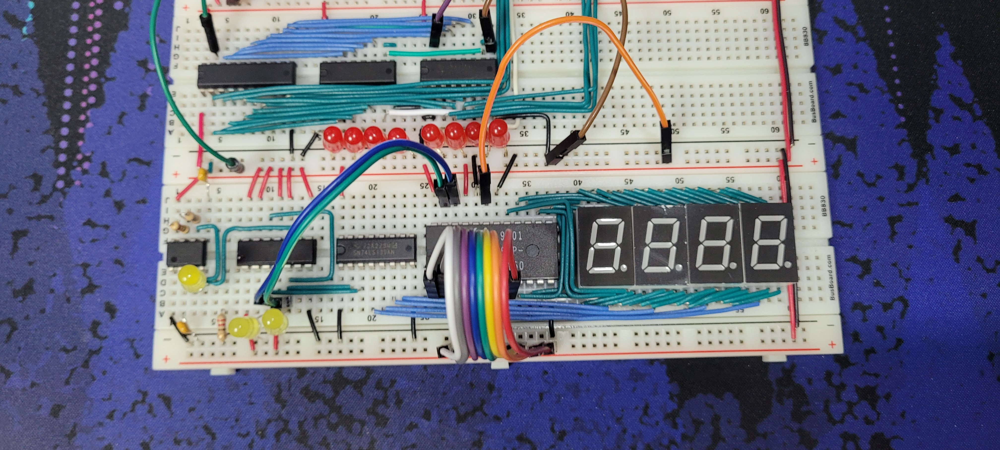

import ImageCaption from "@/components/ImageCaption.astro";
import { Image } from "astro:assets";

The CPU's output will be expressed as a decimal number between -128 and 127 (signed), or 0 and 255 (unsigned). Four 7-segment displays will be used for this project. At a glance, highly complicated logic and wiring seems necessary to drive all four displays. Four displays, with each display having seven separate segments means sending out 28 signals.

Fortunately, the human eye cannot distinguish between a continuous light source and a rapidly flickering one. Furthermore, the signal decoding can be done by mapping all signals to the corresponding 7-segment pattern. Ben Eater’s video does a fantastic job of using a ROM to store the display information to the binary value.

<iframe
  width="100%"
  style="aspect-ratio: 16/9"
  src="https://www.youtube-nocookie.com/embed/K88pgWhEb1M"
  title="YouTube video player"
  frameborder="0"
  allow="accelerometer; autoplay; clipboard-write; encrypted-media; gyroscope; picture-in-picture; web-share"
  referrerpolicy="strict-origin-when-cross-origin"
  allowfullscreen
/>

The output display is built as shown in the video. The leftmost 555 timer chip pulses rapidly, and a 74LS107 Dual J-K flip flop is placed next to it, acting as a 2-bit counter. The third chip is a 74LS139 2-4 Decoder which decodes the counter’s value. This chip pulls the corresponding line of 0~3 to low. This output is tied to the ground pins of each display, meaning the counter and the decoder will only allow one out of four displays to glow at a time. This means that all the same segments of the displays can be tied to one line, and into the ROM.

import or2 from "./or-2.jpg";

<ImageCaption
  src={or2.src}
  alt="Image of the working display."
  caption="The display correctly showing a decimal value."
/>
