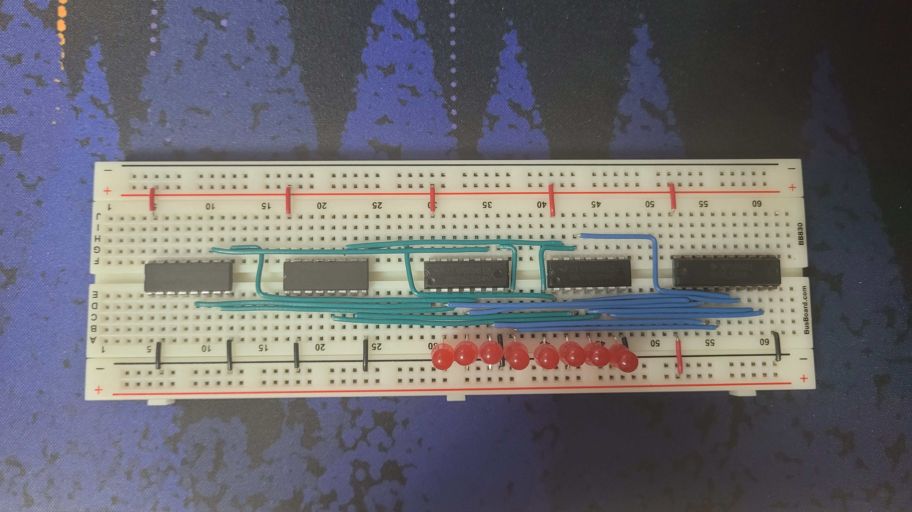
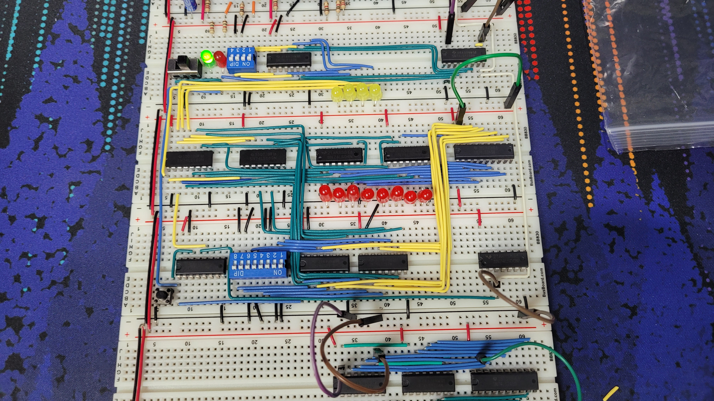
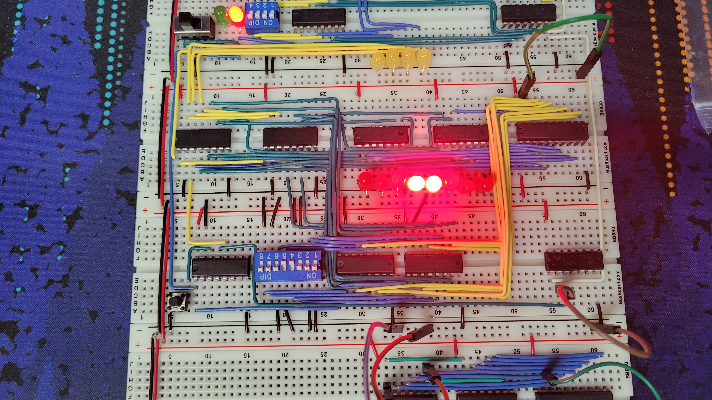

import { Image } from "astro:assets";
import ImageCaption from "@/components/ImageCaption.astro";

The random access memory(RAM) guarantees a constant access time for any memory address. Two 74LS189 RAM chips, each giving 16 words of 4-bit memory, are used to create 16 bytes of RAM. This is the maximum possible amount of memory possible, due to the CPU architecture only using the lower 4 bits for addresses.

The RAM modules are placed on the left, with two inverters on the right as the RAM chips give an inverted output. Finally, the 74LS245 Bus Transciever decides if RAM values are to be uploaded to the bus.

import ls189 from "./74LS189.png";

<ImageCaption
  src={ls189.src}
  alt="Diagram of the 74LS189 RAM chip."
  style="max-height: 240px"
/>

Pin 2 is called Chip Select, enabling the output when set to low. In this case it is tied to ground, so the RAM is always emitting its values. Pins A0 to A3 are the address lines for each of the 16 words.

import ram3 from "./ram-3.jpg";

<ImageCaption
  src={ram3.src}
  alt="Image of the test RAM setup."
  caption="The test RAM setup."
/>

Yellow jumper lines have been temporarily used to set the read/write address and the rainbow colored ones are for loading the 8 bits of data into each word. The brown line toggles Write Enable.

import ram4 from "./ram-4.jpg";

<ImageCaption
  src={ram4.src}
  alt="Image of the RAM module with the clock."
  caption="The RAM module with the clock."
/>

Above the RAM, a DIP switch and 4-bit D register (previously used in the ALU) is added. This combined with some additional logic will allow the user to let the RAM address be determined via bus, or just manually set it with the switches. The 74LS157 Quad 2-to-1 Selector right next to the DIP switch is used to choose the signal to set the address with.

import ram5 from "./ram-5.jpg";

<ImageCaption
  src={ram5.src}
  alt="Image of the RAM module with the clock, with address inputs betwen."
  caption="The RAM module with the clock, with address inputs betwen."
/>

A switch is added to select the address mode, with LEDs to indicate the current mode.

import ram6 from "./ram-6.jpg";

<ImageCaption
  src={ram6.src}
  alt="Image of the RAM value input module added below the RAM module."
  caption="The RAM value input module added below the RAM module."
/>

8 DIP switches are added which allow the contents of the RAM to be set, essentially "programming" it. Three more selectors are added, one on the left of the DIP switches that will choose if the write values comes from the bus of from the switches.

A 74LS00 NAND gate is added to the right, combining the clock and write signals to send to the memory modules.

When manual mode is selected with target address `0000` with the top DIP switches, the RAM can accept the value of `0001 1000` from the lower DIP switches, confirming it works.
