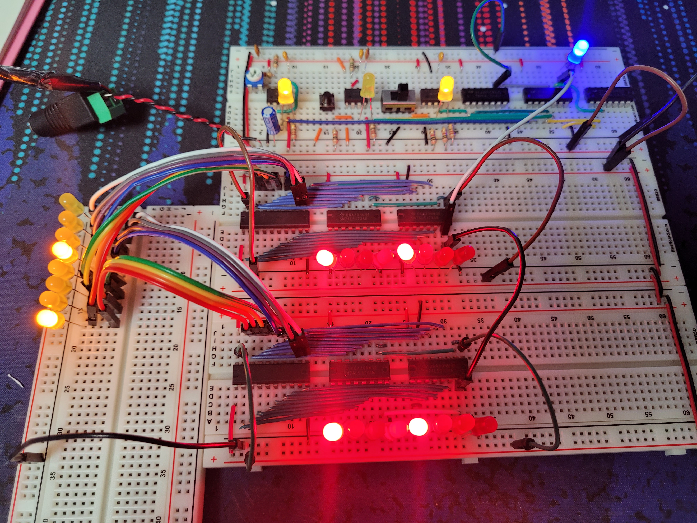
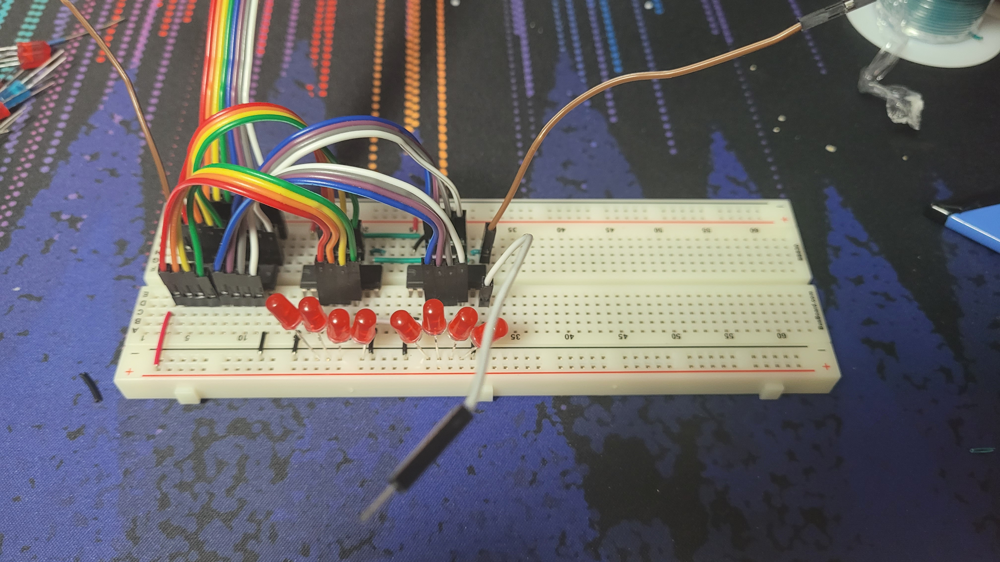
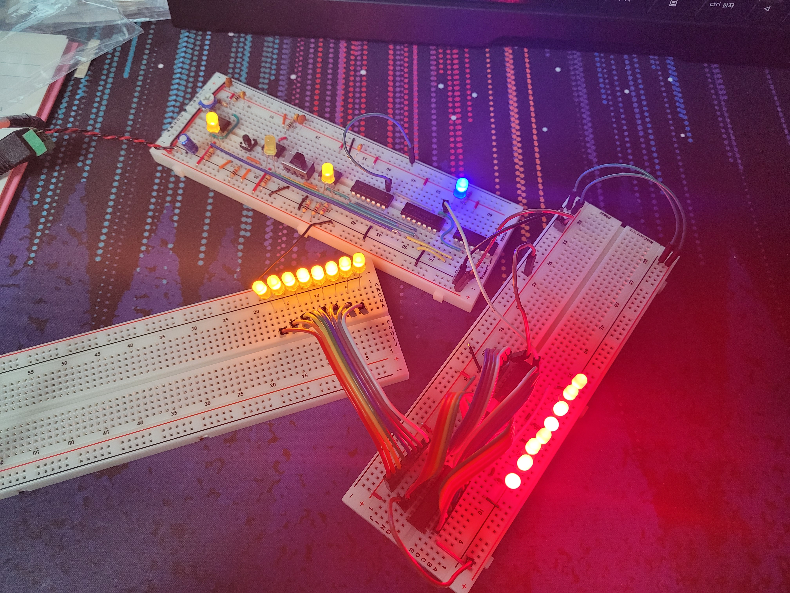
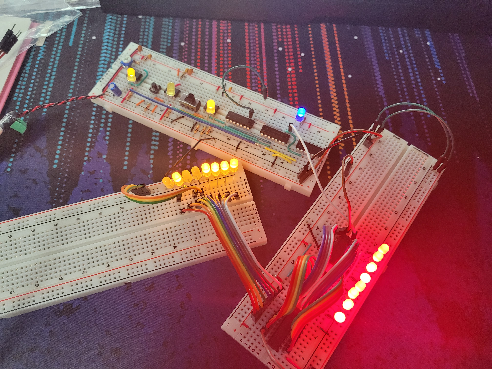
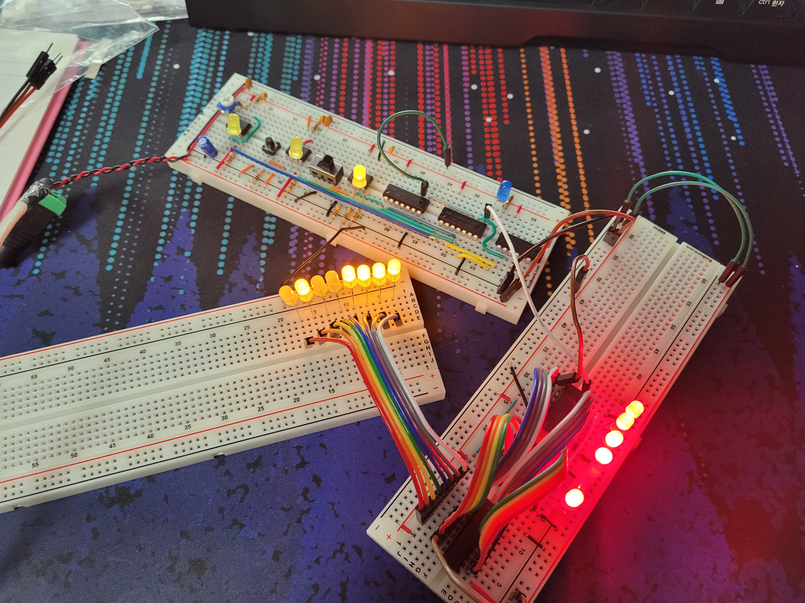
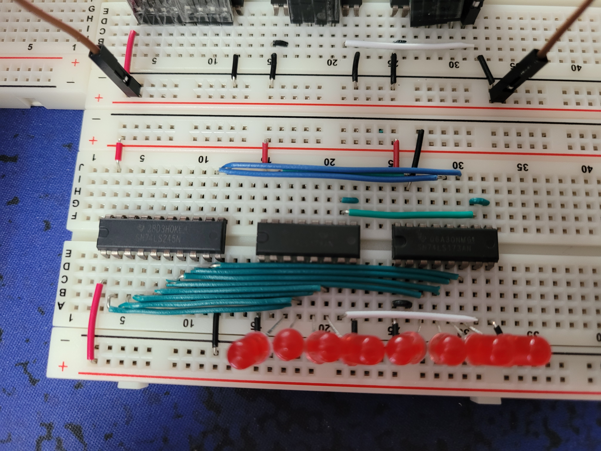
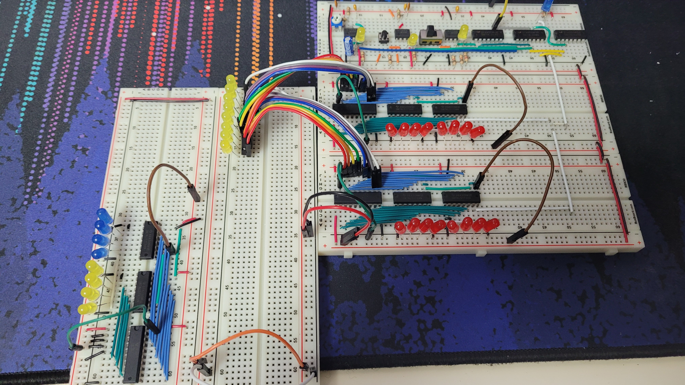
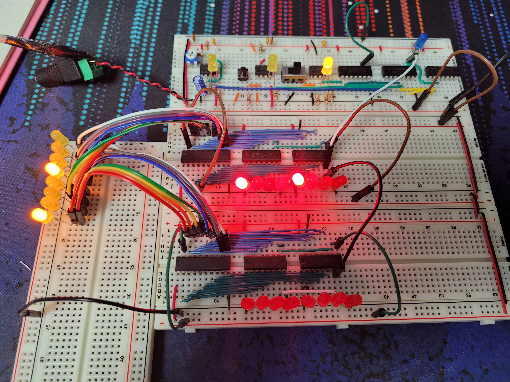

import { Image } from "astro:assets";
import ImageCaption from "@/components/ImageCaption.astro";

Registers can temporarily hold data. Most commonly for storing values used in calculations.
Specific registers exist for instructions, data, and addresses. For all other uses, general purpose registers are used.

#### 4-bit registers

import ls173 from "./74LS173.jpg";
import ls173Pinout from "./74LS173-pinout.png";

  <Image
    src={ls173}
    alt="Image of 74LS173 register chips."
    style="max-height: 200px; object-fit: contain;"
  />
  <Image
    src={ls173Pinout}
    alt="Diagram of 74LS173's pinout."
    style="max-height: 200px; object-fit: contain;"
  />

Two 74LS173 4-bit registers are used to form an 8-bit register.

| Action                | Result                                                 |
| --------------------- | ------------------------------------------------------ |
| Ground pins M and N   | Activate outputs on pins 1Q through 4Q                 |
| Ground pins G1 and G2 | Load bit values at pins 1D through 4D at a clock pulse |

In this case a control mechanism will decide if the register values are uploaded to the bus, so pins G1 and G2 are always grounded.

#### Bus interface

import ls245 from "./74LS245.png";

<ImageCaption
  src={ls245.src}
  alt="Logical diagram of the 74LS245 Octal Bus Transciever."
  style="max-height: 320px;"
/>

The Octal bus transciever decides who gets to use the bus. The DIR line determines the direction of incoming signals. Here, the DIR is always set to high, enabling data flow from bottom to top. Pin A1 to A8 connect to the bus, and B1 to B8 connect to register inputs. At this state, only a clock pulse will load values off the bus into registers.

A sample register was put together for testing. The bus interface sits at the left under the wires, then two 4-bit registers. Register outputs go into LEDs. Bus data moves in and out from the top half of the breadboard.

When provided with power, values inside the registers move into the bus(represented with yellow LEDs.)

Deliberately grounding a few yellow LEDs creates a new value, `0100 1111`. Enabling the load pin then pulsing the clock loads saves the value to the register.

The value persists after being loaded into the register, after removing the grounded wires on the bus.

After tidying up the wires, a register is complete. Clock signals have been color-coded into white. The CPU needs three registers - General Purpose Register A and B, and an Instruction Register(IR).

#### Moving values between registers

Through a bus, a value can be copied from one register to another.

A makeshift bus is made, represented by the line of yellow LEDs. The stack of breadboards on the right are the two registers, and the clock. Green jumper wires control upload from the registers, brown wires control value loading.

A value of `1000 1000` is loaded into Register A from the bus, which also starts emitting the value back onto the bus.

| Mode   | Register A | Register B |
| ------ | ---------- | ---------- |
| Upload | Enabled    | Disabled   |
| Load   | Disabled   | Enabled    |

On the next clock pulse copies the value from Register A, proving the concept of data transfer through a bus.

After copying, Register A must stop uploading onto the bus. For now this is a manual switching of wires.

The complete CPU will have programmable capabilities. Binary commands will be read by another mechanism then broken down into micro-operations(operations able to be run in one clock pulse). Each micro-operation will automatically handle enabling and disabling upload and load lines.

After that stage, programming the CPU can be done at a higher level with a homemade assembly language, making the process much easier. This tracks with the actual history of computer evolution.
