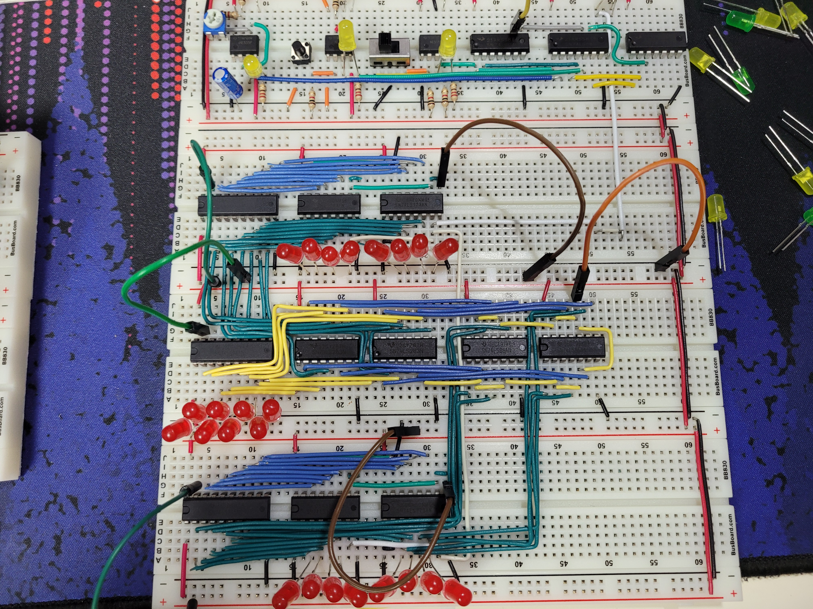
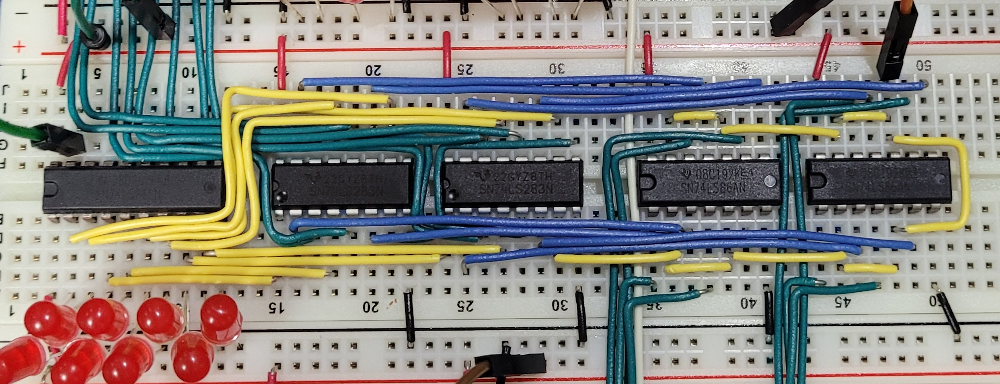
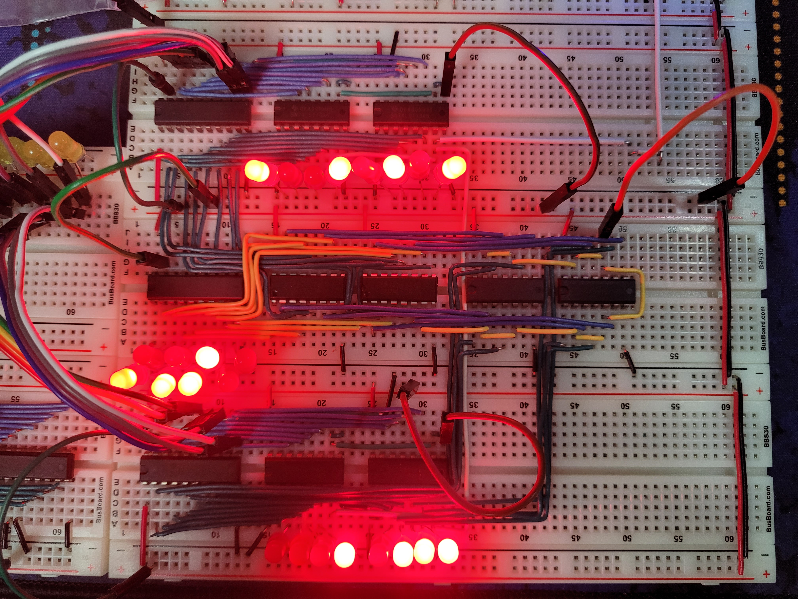
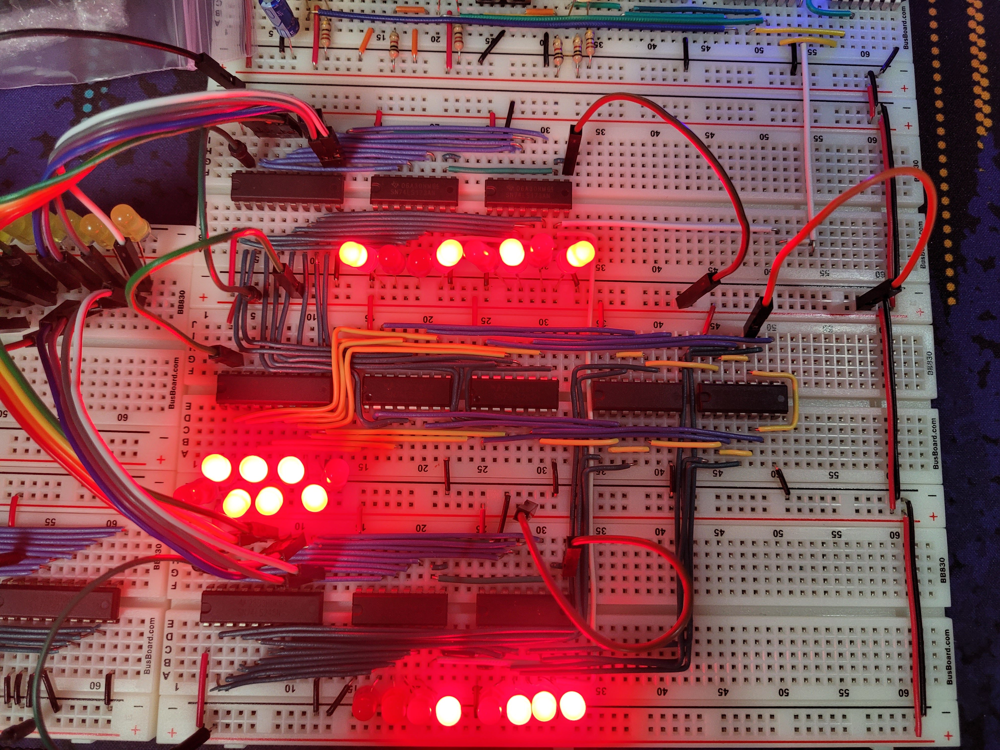

import ImageCaption from "@/components/ImageCaption.astro";
import { Image } from "astro:assets";

The Arithmetic and Logic Unit(ALU) of the CPU is where the actual calculations happen. Their most basic function is addition, done by adders. Each adder handles addition of only one digit.

import halfAdder from "./half-adder.jpg";

  <Image
    src={halfAdder}
    alt="Diagram of a half adder."
    style="margin: auto; max-height: 180px; object-fit: contain"
  />
  
    The most simple form of adder is created with one XOR gate and one AND gate.
    If either input is 1, the sum is 1. If both inputs are 1, the sum is 0 with
    the carry set to 1.
  

It _is_ possible to chain eight adders together for an 8-bit adder. However, the cost and size will be quite prohibitive. Fortunately, a chip that packages all of this together exists.

import ls283 from "./74LS283.png";

<ImageCaption
  src={ls283}
  alt="Diagram of the 74LS283 4-bit ALU."
  style="max-height: 320px;"
/>

The 74LS283 is a 4-bit ALU, so chaining two will give an 8-bit ALU. The carry bit(Pin C0) just needs to go into the first input(Pin C4) of the second ALU. If a carry happens on the final eighth bit, no further actions will happen to handle this result. A carry flag on the CPU will be set to signal that an overflow happened.

# Subtraction by addition

Adders are named adders for a reason - they can only add. But subtractions can be done with two's complement. A binary value can be converted into two's complement by inverting each bit (`0`s to `1`s, `1`s to `0`s) then adding 1.
In hardware, this is possible by running each digit through an XOR gate then adding one at the ALU's input.

The CPU now sits at a stack of four breadboards, top to bottom: Clock, Register A, ALU, Register B.

The 74LS86 Quad XOR provides four XOR gates per chip. Two of them can invert an 8-bit value. The yellow wire surrounding the XOR gates tie all of the first inputs together, and the orange jumper wire chooses between power and ground. Giving power flips all bits. The one yellow wire bridging the ALUs on the left act as an input to the first bit of the ALU, the "add one" operation of deriving the two's complement.

<table>
  <thead>
    <tr>
      <th>Register</th>
      <th>Bit Value</th>
    </tr>
  </thead>
  <tbody>
    <tr>
      <td>Register A</td>
      <td>
        <code>1001 0101</code> (149)
      </td>
    </tr>
    <tr>
      <td>Register B</td>
      <td>
        <code>0001 0111</code> (23)
      </td>
    </tr>
    <tr>
      <td style="border-top: 2px solid rgb(var(--gray))">
        <strong>Sum</strong>
      </td>
      <td style="border-top: 2px solid rgb(var(--gray))">
        <code>1010 1100</code> (172)
      </td>
    </tr>
  </tbody>
</table>

In the subtraction test, the orange wire is plugged into power for two's complement mode.

<table>
  <thead>
    <tr>
      <th>Register</th>
      <th>Bit Value</th>
    </tr>
  </thead>
  <tbody>
    <tr>
      <td>Register A</td>
      <td>
        <code>1001 0101</code> (149)
      </td>
    </tr>
    <tr>
      <td>Register B</td>
      <td>
        <code>0001 0111</code> (23)
      </td>
    </tr>
    <tr>
      <td style="border-top: 2px solid rgb(var(--gray))">
        <strong>Sum</strong>
      </td>
      <td style="border-top: 2px solid rgb(var(--gray))">
        <code>0111 1110</code> (26)
      </td>
    </tr>
  </tbody>
</table>
