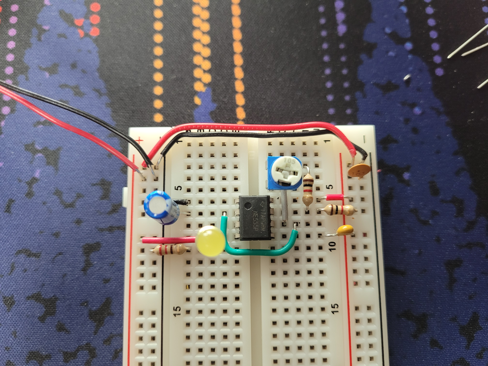
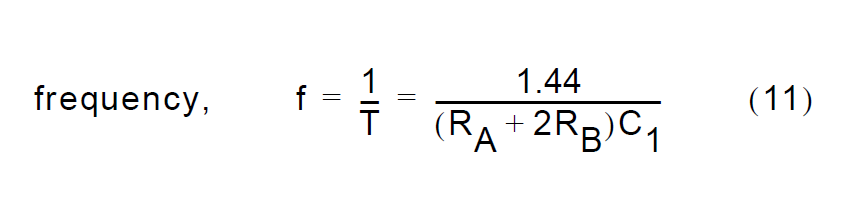
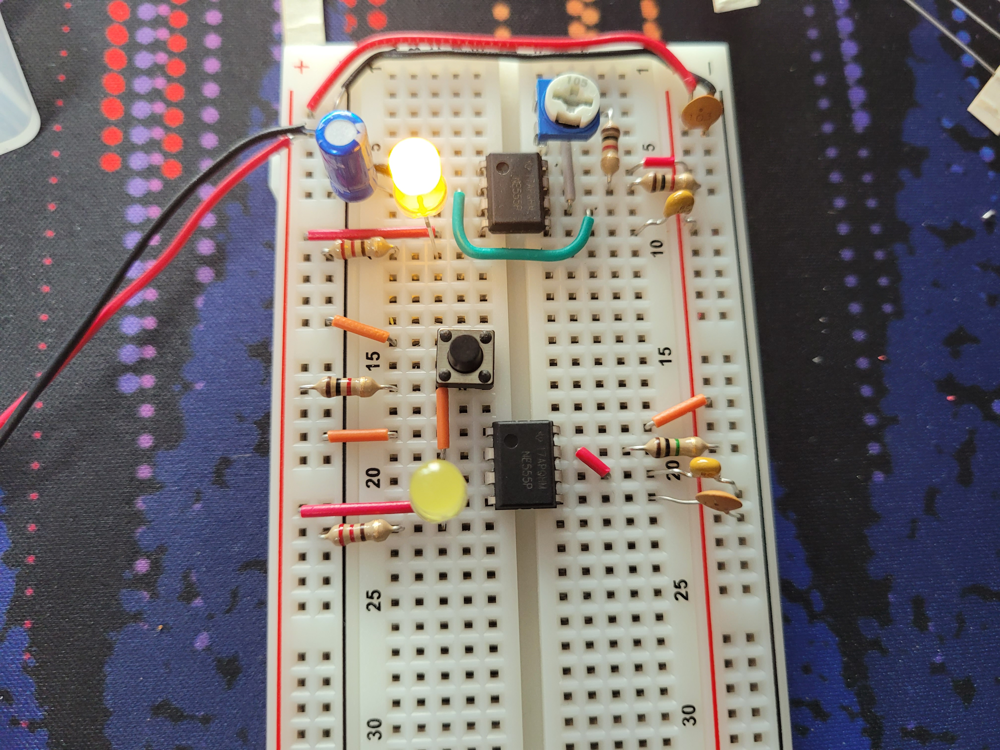
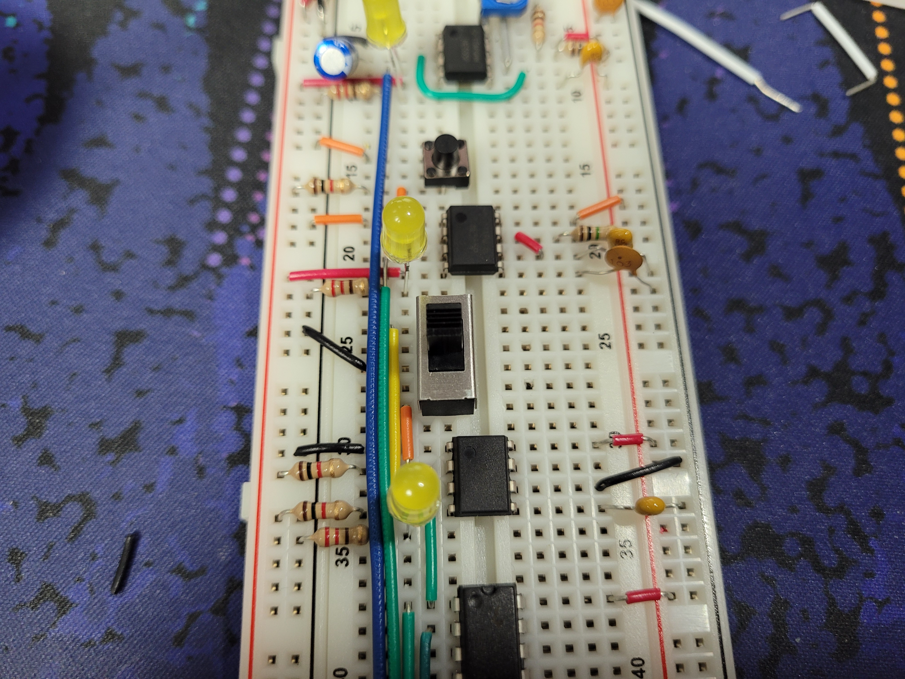
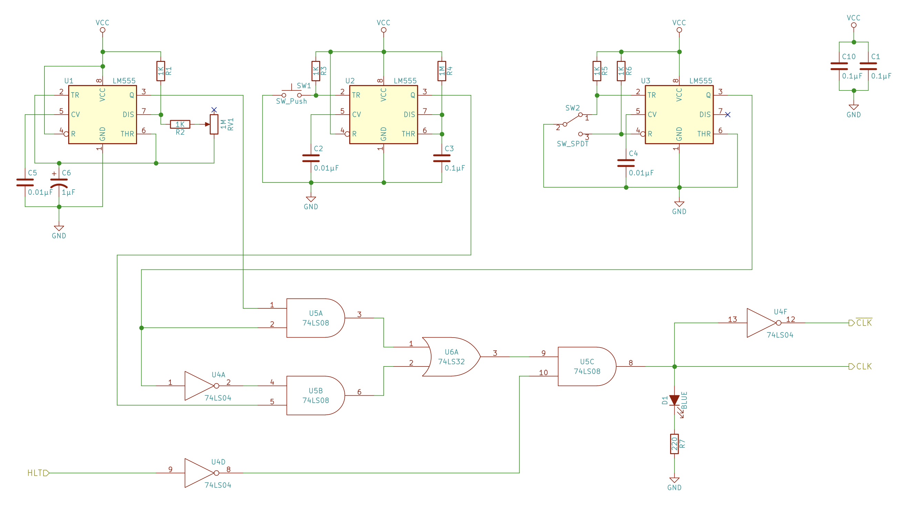
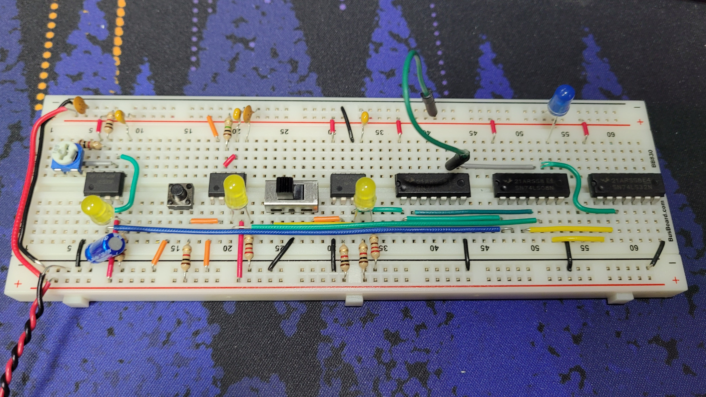

import ImageCaption from "@/components/ImageCaption.astro";

# Overview

The clock is one of the most basic yet important components of a CPU. Every action a CPU takes will be based on a clock pulse. A clock's job is to generate a pulse every set period, forming a square wave pattern.

import squareWave from "./square-wave.png";

<ImageCaption src={squareWave} alt="A square wave under an oscilloscope." />

The 555 Timer IC chip is designed for this exact purpose. Released in 1972 and still widely used in various applications, the basic mechanism is made of resistors and a capacitor.

import internals555 from "./555-internals.png";

<ImageCaption src={internals555} alt="The internal diagram of a 555 timer." />

The 555 offers a variable frequency. As the chip works by continuously charging then discharging a capacitor, the pulse frequency can be adjusted by the using different resistors and capacitors.

In this component, two 555 chips are used for different operation modes.

# Astable clock

An astable(a-stable, meaning "not stable") clock has no resting, stable state. In other words, the clock will keep switching between high and low without human intervention.

| Pin | Role                                                                    |
| --- | ----------------------------------------------------------------------- |
| 1   | Ground                                                                  |
| 2   | 1µF capacitor to ground; also connect to Pin 6 for astable mode         |
| 3   | Output pulse (LED)                                                      |
| 4   | Tied to high; prevents resets                                           |
| 5   | Can be empty; 0.01µF capacitor added via manufacturer's recommendations |
| 6   | Wired to Pin 2                                                          |
| 7   | Discharge, 1K Ohm resistor + variable resistor                          |

The variable resistor offers a range of 0 Ohm to 1M Ohm - to prevent shorting a 1K Ohm resistor was added.

From the datasheet, the period of the pulse can be derived from:

| Symbol        | Definition                                  |
| ------------- | ------------------------------------------- |
| RA | First 1K Ohm bridging the 5V line and Pin 7 |
| RB | Variable resistor                           |
| C1 | 1µF wiring Pin 6 to ground                  |

RB has a range of 1K Ohms to 1M Ohms (1.001M to be precise) which leads to `f` having a value between **1.43Hz ~ 720Hz**.
Considering modern desktop processors run at 3GHz or higher, this CPU is 4 million times slower just by pure clock count.

Providing power to the assembled clock, turning the resistor increases the resistance and makes the clock run slower. Reversing the resistor maxes it out at 720Hz, making the LED seem continuously lit to the eye.

# Monostable clock

A monostable(mono-, meaning "one") clock has only one stable state, high or low. This means the clock will eventually return to its stable state. In this case the monostable clock will be set to low by default, and pressing a button will make the clock emit a single pulse. This will allow manual CPU cycling, which will be very handy in later debugging.

The components may be different, but the basic mechanism is similar. The capacitor is charged when clicking the button, then drained through the 1M Ohm resistor.
Just a button by itself would have the same effect, but the 555 debounces the signal.

# Bistable clock

A bistable clock has two stable states, and is comfortable with staying either high or low. This may sound like a regular switch, but the same debouncing problem exists in switches, hence the 555.

The SR latch in the timer will be used.

import latch555 from "./555-latch.png";

<ImageCaption src={latch555} alt="The SR latch inside the 555 timer." />

# Combination logic

There are now three kinds of clocks on the breadboard now. The bistable clock will be used to select between the astable and monostable clocks.
Simple logic gates can be used to combine the clocks into one, with the selected clock's pulse being emitted.

import ls04 from "./74LS04.png";
import ls08 from "./74LS08.png";
import ls32 from "./74LS32.png";

  <ImageCaption src={ls04} alt="Logical diagram of the 74LS04 Hex Inverter." />
  <ImageCaption src={ls08} alt="Logical diagram of the 74LS08 Quad AND Gate." />
  <ImageCaption src={ls32} alt="Logical diagram of the 74LS32 Quad OR Gate." />

The selector signal goes into two AND gates along each clock. The OR gate combines the two signals, and the final AND gate will receive a HALT signal in the future. The full clock output is shown via LED.

The green jumper wire is for the halt signal, but is currently set to 5V.
